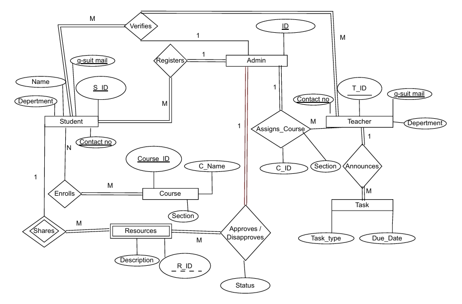
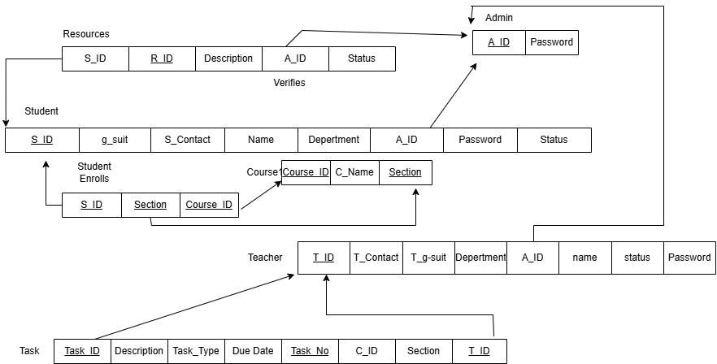
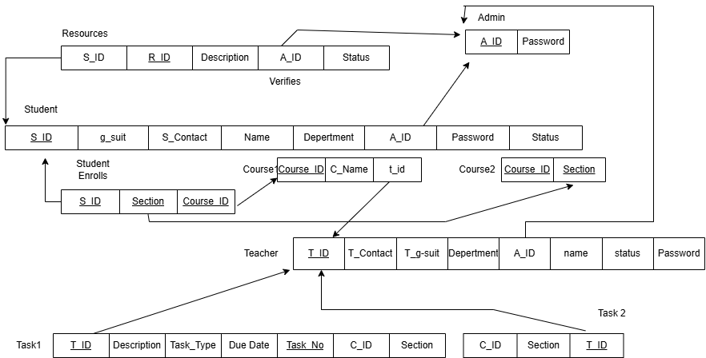

# UniTask Manager CSE370 Project

## 📚 Course Information

* **Course Code:** CSE370
* **Course Title:** Database 
* **Project Type:** Lab Project


## 📌 Project Overview

**UniTask Manager** is a database-driven task management system developed as part of the **CSE370 (Database) Lab**. The project focuses on designing and implementing a structured relational database to manage academic tasks efficiently.

This system demonstrates core database concepts such as entity-relationship modeling, normalization, primary and foreign keys, and CRUD (Create, Read, Update, Delete) operations.

---

## 🎯 Objectives

* To apply database design concepts learned in CSE370
* To implement a relational database for task management
* To practice SQL queries and constraints
* To understand real-world database-driven application workflows

---

## 🛠️ Features

### 👤 Student Panel
* **Secure Dashboard:** View personal academic status.
* **Course Enrollment:** Enroll in specific course sections.
* **Resource Sharing:** Submit academic resources (notes, links) for Admin approval.
* **Access Materials:** View approved resources and course materials.

### 👨‍🏫 Teacher Panel
* **Course Management:** View assigned courses and sections.
* **Task Creation:** Assign homework, quizzes, labs, and projects.
* **Student Tracking:** View students enrolled in specific sections.

### 🛡️ Admin Panel
* **User Verification:** Verify pending Student and Teacher accounts.
* **Resource Moderation:** Approve or reject resources submitted by students.
* **Directory Access:** View full lists of faculty and students.
* **System Oversight:** Manage database integrity and course offerings.

## Diagram


## 🗂️ Database Concepts Used

* Entity Relationship (ER) Diagram
* Relational Schema Design
* Primary Key & Foreign Key Constraints
* Normalization (up to 3NF)
* SQL Queries

## 💾 Database Schema

The database consists of the following key entities:
* **Users:** `admin`, `student`, `teacher` (Role-based separation).
* **Academics:** `course`, `student_enrolls`.
* **Content:** `resource` (includes status flags for approval), `task`.
---
## Schema


## Normalization


## 💻 Technologies Used

* **Frontend:** HTML5, CSS3, JavaScript, **Bootstrap 5** (Bootswatch "Flatly" Theme).
* **Backend:** PHP (Vanilla).
* **Database:** MySQL / MariaDB (InnoDB Engine).
* **Icons:** Bootstrap Icons.

---

---

## 📄 Project Structure
## 📂 Project Files

```text
/unitask
│
├── SQL Code.txt           # Contains all SQL commands to create the database
├── admin_dashboard.php    # Admin panel (Verify users, manage resources)
├── admin_login.php        # Dedicated login handler for Administrators
├── db_connect.php         # Database connection settings ($conn)
├── enroll.php             # Logic for student course enrollment
├── header.php             # Global navigation bar and session start
├── index.php              # Main Landing Page / General Login
├── logout.php             # Script to destroy session and redirect to login
├── register.php           # Registration page for new Students/Teachers
├── resources.php          # Page for viewing or managing academic resources
├── student_dashboard.php  # Main dashboard for Students
└── teacher_dashboard.php  # Main dashboard for Teachers
---


---
## 👤 Author

**Akib Zawad**
**Enan Mahmud**
---


